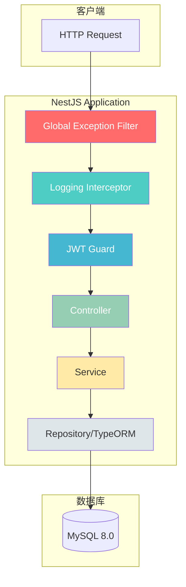
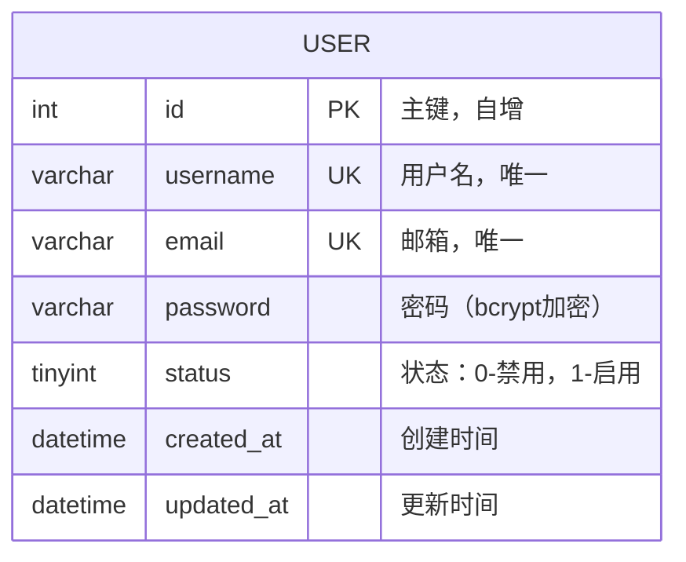

# NestJS 用户认证系统 - 项目设计文档

## 1. 系统架构



## 2. ER 图



## 3. 接口清单

### AuthController (`/api/auth`)

| 方法 | 路径 | 描述 | 认证 |
|------|------|------|------|
| POST | `/register` | 用户注册 | 否 |
| POST | `/login` | 用户登录 | 否 |
| GET | `/profile` | 获取当前用户信息 | JWT |
| POST | `/refresh` | 刷新Token | JWT |

### UserController (`/api/users`)

| 方法 | 路径 | 描述 | 认证 |
|------|------|------|------|
| GET | `/` | 获取用户列表 | JWT |
| GET | `/:id` | 获取用户详情 | JWT |
| PATCH | `/:id` | 更新用户信息 | JWT |
| DELETE | `/:id` | 删除用户 | JWT |

## 4. 核心模块设计

### 4.1 全局异常处理 (GlobalExceptionFilter)

- 捕获所有未处理异常
- 统一响应格式：`{ code, message, data, timestamp }`
- 区分 HttpException 和系统异常
- 生产环境隐藏敏感错误信息

### 4.2 日志拦截器 (LoggingInterceptor)

- 记录请求方法、URL、耗时
- 记录请求参数（脱敏处理）
- 记录响应状态码
- 支持链路追踪 ID

### 4.3 JWT 认证守卫 (JwtAuthGuard)

- 基于 Passport JWT 策略
- Token 过期时间：24小时
- 支持 Bearer Token 方式

## 5. 目录结构

```
backend/
├── src/
│   ├── common/                 # 公共模块
│   │   ├── decorators/         # 自定义装饰器
│   │   │   ├── current-user.decorator.ts
│   │   │   └── public.decorator.ts
│   │   ├── dto/                # 公共DTO
│   │   │   └── api-response.dto.ts
│   │   ├── filters/            # 异常过滤器
│   │   │   └── global-exception.filter.ts
│   │   ├── guards/             # 守卫
│   │   │   └── jwt-auth.guard.ts
│   │   └── interceptors/       # 拦截器
│   │       ├── logging.interceptor.ts
│   │       └── transform.interceptor.ts
│   ├── config/                 # 配置
│   │   ├── database.config.ts
│   │   └── jwt.config.ts
│   ├── modules/                # 业务模块
│   │   ├── auth/               # 认证模块
│   │   │   ├── dto/
│   │   │   ├── strategies/
│   │   │   ├── auth.controller.ts
│   │   │   ├── auth.module.ts
│   │   │   └── auth.service.ts
│   │   └── user/               # 用户模块
│   │       ├── dto/
│   │       ├── entities/
│   │       ├── user.controller.ts
│   │       ├── user.module.ts
│   │       └── user.service.ts
│   ├── app.module.ts
│   └── main.ts
├── test/
├── Dockerfile
├── package.json
├── tsconfig.json
└── nest-cli.json
```

## 6. 技术规范

### 6.1 响应格式

```typescript
{
  code: number;      // 业务状态码，200为成功
  message: string;   // 提示信息
  data: T | null;    // 响应数据
  timestamp: string; // ISO 时间戳
}
```

### 6.2 错误码定义

| 状态码 | 描述 |
|--------|------|
| 200 | 成功 |
| 400 | 请求参数错误 |
| 401 | 未授权 |
| 403 | 禁止访问 |
| 404 | 资源不存在 |
| 409 | 资源冲突（如用户名已存在） |
| 500 | 服务器内部错误 |

### 6.3 环境变量

| 变量名 | 描述 | 默认值 |
|--------|------|--------|
| `PORT` | 服务端口 | 3000 |
| `DB_HOST` | 数据库主机 | localhost |
| `DB_PORT` | 数据库端口 | 3306 |
| `DB_USERNAME` | 数据库用户名 | root |
| `DB_PASSWORD` | 数据库密码 | - |
| `DB_DATABASE` | 数据库名称 | nestjs_auth |
| `JWT_SECRET` | JWT密钥 | - |
| `JWT_EXPIRES_IN` | Token过期时间 | 24h |
